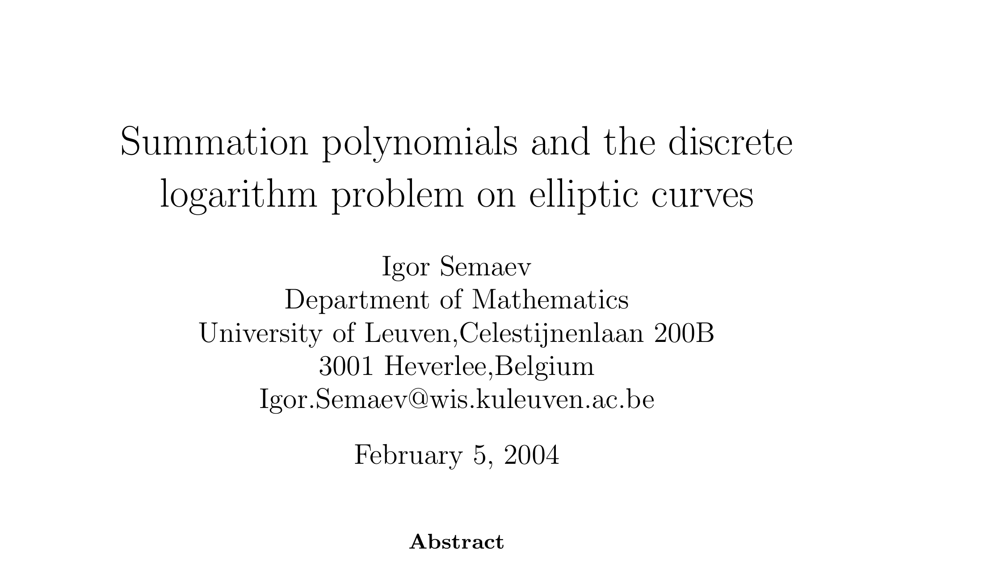

# Index Calculus on Elliptic Curves using Semaev Summation Polynomials
### Unofficial implementation of Igor Semaev's 2004 paper 'Summation Polynomials and the Discrete Logarithm Problem on Elliptic Curves'

The paper Summation Polynomials and the Discrete Logarithm Problem on Elliptic Curves (Semaev, 2004) introduced the idea of index calculus on an elliptic curve over a prime finite field. 

### Paper Summary: 
1. Semaev polynomials are a **computational shortcut to find points that sum to infinity**.
   - Elliptic curve addition is a pretty expensive operation so this paper demonstrates a less expensive approach to addition
3. Each elliptic curve has a unique semaev polynomial set.
4. You sum Semaev polynomials modulo the field characteristic(number of points on the elliptic curve) not the generator order

I coded this for my startup, LeetArxiv. The complete walkthrough is available at this [link](https://leetarxiv.substack.com/p/semaev-naive-index-calculus).

### Quick Start
All the relevant code is in the file `Find Relations.c`. We work on the bitcoin curve but the curve has 20959 points and the generator point order is 20947.
```
clear && gcc FindRelations.c -lm -o m.o && ./m.o
```

Complete walkthrough is available here: [https://leetarxiv.substack.com/p/semaev-naive-index-calculus](https://leetarxiv.substack.com/p/semaev-naive-index-calculus)
